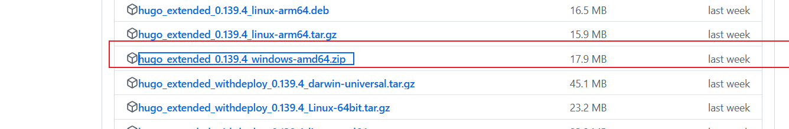

# My First Post


&lt;!--more--&gt;

# 如何使用 hugo site 生成一篇文章
网站进入主目录
``` bash
 hugo new content content/posts/myposts.md
```
# 如何升级主题
在 ```master```分支执行
```
git submodule update --remote --merge themes/FixIt
```
# 如何不发布草稿
修改 github workflow 中的```Build Web```
```bash
- name: Build Web
run: hugo --minify
```
当文档开头的 draft 选项为 true 时，这篇文档将不会被发布
# 如何升级 hugo 版本
从 github 下载指定版本的安装包，解压后把里面的文件替换到旧版 hugo 安装路径



---

> 作者:   
> URL: http://example.org/posts/583bc6c/  

